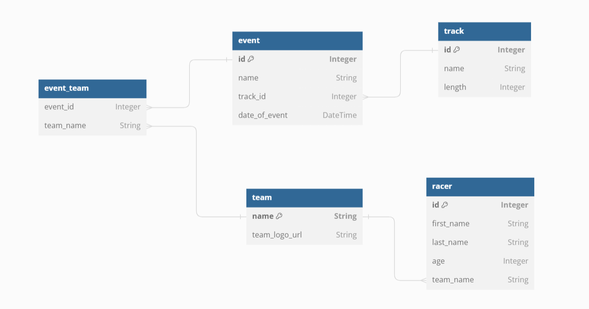

# Spring Boot + DB
For today's lab we will create and connect to our own DB instance. You will create a simple tables with appropriate entities, repositories. Then we will call them via REST API.

# Task 0
Setup a PostgreSQL DB on your machine. If you have problem you can use the following [guide](https://github.com/dreamix-fmi-course-2024/web-development-with-java-lab/blob/main/lab08/postgresql.md)

(***NB***) you can use MySQL DB too or your preferable DB.

You can also use Docker (tutorial will be applied later)

# Task 1
Setup a connection from RaceManagement system to your newly created DB.

```
Abstract steps:
1. add necessary dependencies
2. add properties inside the application property file (.properties or .yml) for your DB connection (connection string, driver, dialect, etc)
```
For the configurations you can use the example from [lecture week08-2022](https://github.com/GeorgiMinkov/web-development-with-Java/tree/main/week08/demo/FMI_DB_JPA) .
and from -> [2023-2024 lecture examples](https://github.com/dndanoff/java-db-connectivity)
```
spring.datasource.url=jdbc:postgresql://localhost:5433/postgres
spring.datasource.username=postgres
spring.datasource.password=pgadmin
spring.jpa.properties.hibernate.dialect = org.hibernate.dialect.PostgreSQLDialect
spring.jpa.database=postgresql
spring.jpa.hibernate.ddl-auto=update
```

---
### *For the next steps we will use only Racer controller/service/repository/entity  as there is no relations for now*
---

# Task 2
Cleanup your entity model classes, for beginning we will remove all dependencies from the tables.

For simplicity lets have single Racer table.

You can use spring property ddl-auto = update in order to create DB tables from code.

To create entity classes you will need the following annotations:

 - @Entity - annotation specifies that the class is an entity and is mapped to a database table. The @Table annotation specifies the name of the database table to be used for mapping
 - @Id - annotation specifies the primary key of an entity
 - @GeneratedValue(strategy = GenerationType.AUTO) - provides for the specification of generation strategies for the values of primary keys
 - @Column - annotation is used to specify the mapped column for a persistent property or field

Example:
```
@Data
@Entity
public class Invoice {

    @Id
    @GeneratedValue(strategy = GenerationType.AUTO)
    private Long invoiceId;

    @Column
    private String invoiceNumber;

    @Column
    private String customerName;

    @Column
    private LocalDate invoiceDate;

    @Column
    private BigDecimal basePrice;

    @Column
    private BigDecimal taxRate;

    @Column
    private BigDecimal totalPrice;
}

```


# Task 3
Modify your repository classes for Racer to use the real DB

# Task 4
Using REST APIs for Racer test your application via Postman.

To accomplish it change the necessary services.

# Task 5 - next time
By fully developed schema you will need to define relationship structure betweens entity.

<details>
<summary>SQL Schema</summary>
CREATE TABLE track (
    id SERIAL PRIMARY KEY,
    name VARCHAR(255),
    length INTEGER
);

CREATE TABLE team (
    name VARCHAR(255) PRIMARY KEY,
    team_logo_url VARCHAR(255) -- URL to the team's logo
);

CREATE TABLE racer (
    id SERIAL PRIMARY KEY,
    first_name VARCHAR(255),
    last_name VARCHAR(255),
    age INTEGER,
    team_name VARCHAR(255) REFERENCES team(name) ON DELETE SET NULL
);

CREATE TABLE event (
    id SERIAL PRIMARY KEY,
    name VARCHAR(255),
    track_id INTEGER REFERENCES track(id) ON DELETE SET NULL,
    date_of_event TIMESTAMP
);

CREATE TABLE event_team (
    event_id INTEGER REFERENCES event(id) ON DELETE CASCADE,
    team_name VARCHAR(255) REFERENCES team(name) ON DELETE CASCADE,
    PRIMARY KEY (event_id, team_name)
);
</details>

DB Diagram



