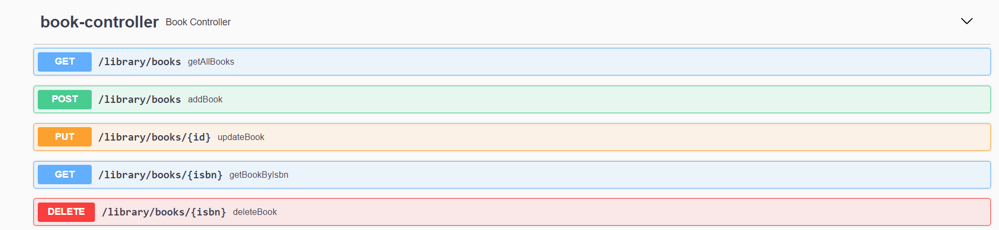
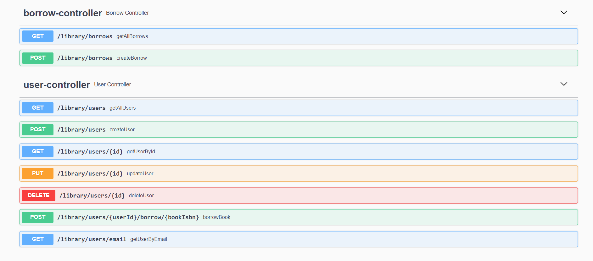
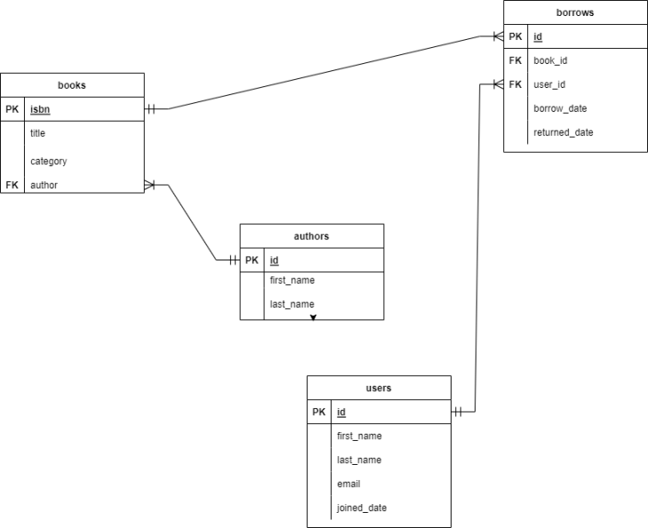
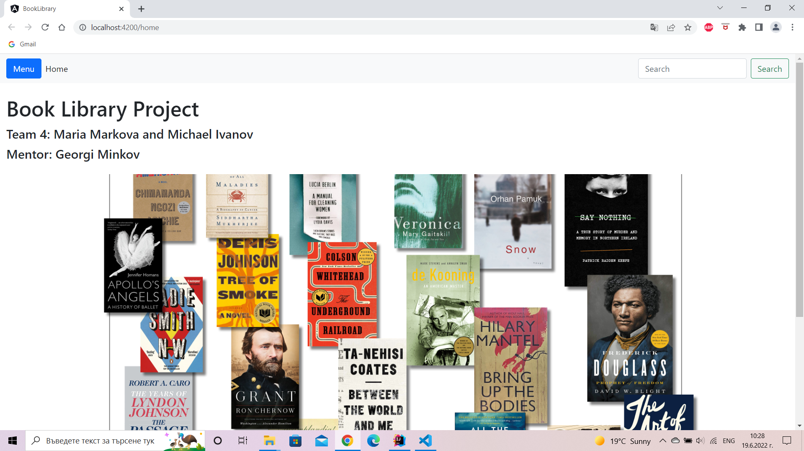
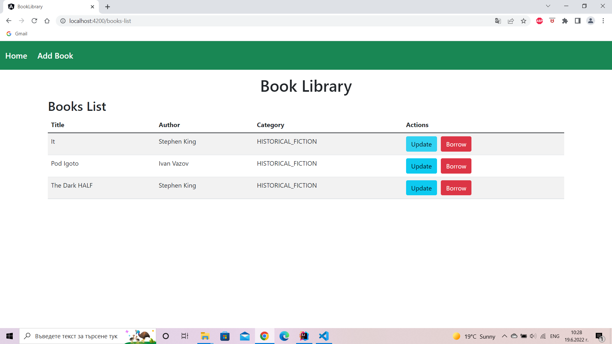
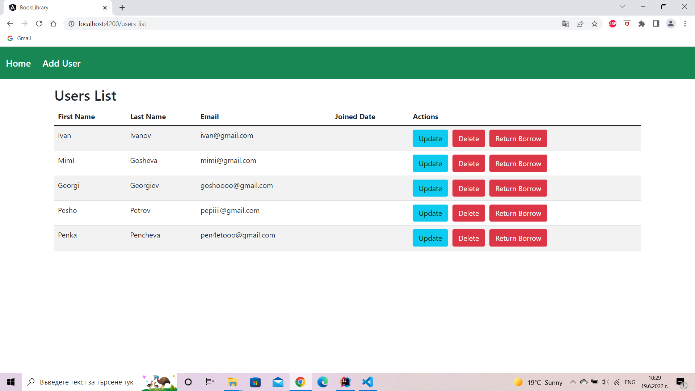
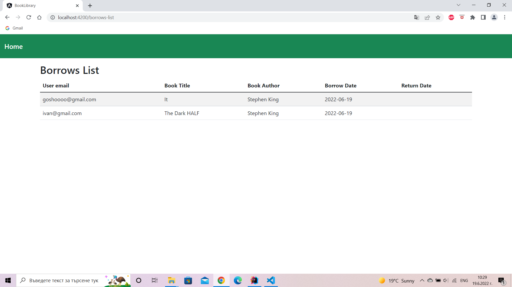
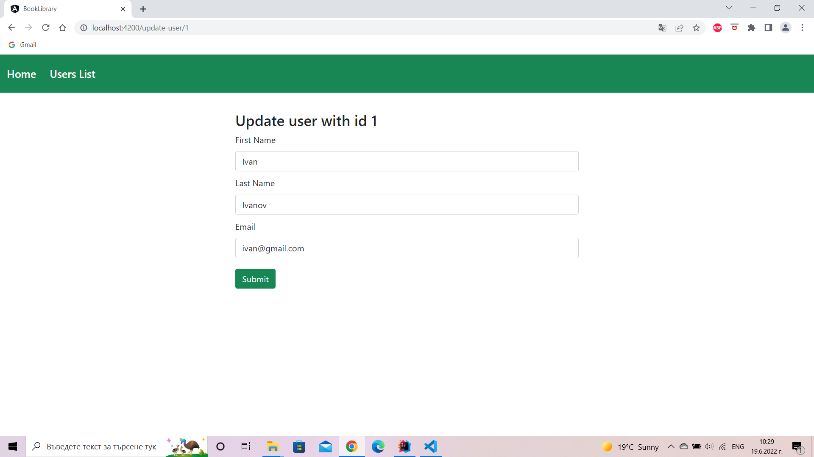
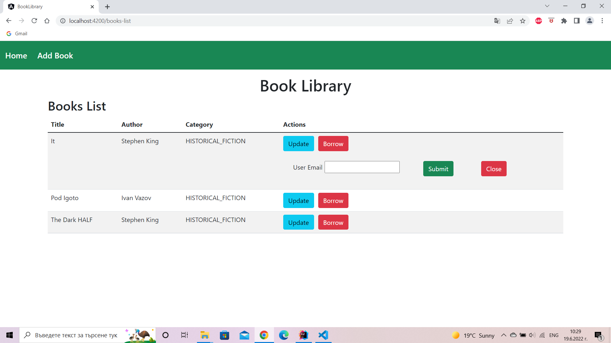
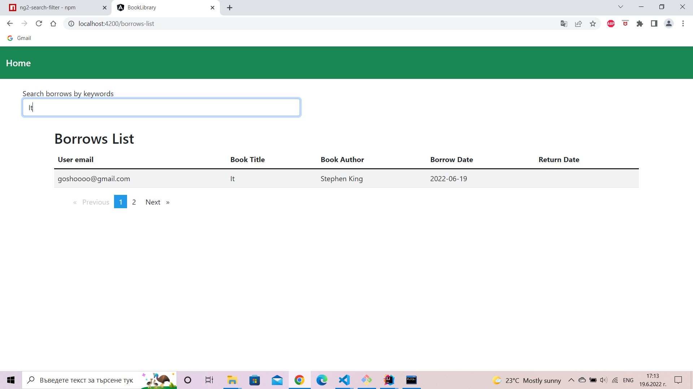

# Book Libarary 📚

## Table of Contents
  - [🎇 General Information](#-general-information)
  - [📝 Business Requirements](#-business-requirements)
  - [🌊 Git flow](#-git-flow)
  - [🏤 Architecture](#-architecture)
  - [📍 Endpoints](#-endpoints)
  - [📄 Database Model](#-database-model)
  - [🔨 Software Technologies](#-software-technologies)
  - [⚙️ Setup](#️-setup)
  - [📸 Screenshots](#-screenshots)
  - [🎉 Acknowledgements](#-acknowledgements)
  - [💬 Contact](#-contact)
  

---
## 🎇 General Information
The idea of the project is to develop a web-based library management system. This is a project that manages and stores information about books, users, authors and borrows. The system helps both users and admins to keep track of all the books that are available in the library at the current time. It also stores information about borrowed and returned books.  This task if carried out manually will be tedious and includes chances of mistakes. These errors are avoided by allowing the system to keep track of information such as date of borrow and date to return the book.

---
## 📝 Business Requirements
Our app allows to:
- View a list of all books 
- Add new books to the list
- Update book info
- Borrow a book
- Add user to the library system
- Delete user from the system
- Update user info
- Users can return books that they have borrowed
- View present borrows in a list
- Search in the borrows list by a keyword
  
---
## 🌊 Git flow
The main branch contains production-ready code that can be released. The main branch was created at the beginning of the project and was maintained throughout the development process. 

Many feature branches were used to enable parallel development on the same or on completely different functionalities of the project. The first step is to checkout from the main branch. Once the changes are made to the code, the developer makes what is known as a pull request, or a request to have other developers on the team do a code review to ensure that the local branch does not have any errors, and also that it will not cause any errors when merged into the main branch. Once a branch has been thoroughly reviewed, it can then be merged into the main branch.

---
## 🏤 Architecture
The project consists of two layers: front-end and back-end.

### 1. 🏗️ Back-end 
Packages: 
- `controller` - all controller classes are in this package, they contain all the endpoints that are supported.
- `dto` - contains all data transfer objects that were used to carry data between processes
- `exceptions` - contains all the custom exceptions that are used throughout the project, the package also includes controller advice that is used for handling the exceptions
- `model` - entities, representing data that can be persisted to the database
- `repository` - all interfaces used to access, manage, and persist data between Java object and relational database, automatically generate queries from the method names
- `service` - this layer contains business logic, it mediates communication between a controller and repository layer

### 2. 💻 Front-end
Packages:
- `component`
- `model`
- `services` 

---
## 📍 Endpoints

---
## 📄 Database Model
The library data model consists of five tables divided into two subject areas: 
- Books
- Members
  
---
### <ins>Books</ins>

The Books subject area stores information about two tables: `books` and `authors`.

---
The first table is the <ins>`authors`</ins> table. It lists all the authors of the books that the library has in its collection. For each author we have:
- `id` – a unique ID for that author
- `first_name`– The first name of the author.
- `last_name`– The last name of the author.

Next, we have the <ins>`book`</ins> table. This table stores all the relevant details of every title that the library has in its collection. The book table consists of the attributes:
- `isbn` – A unique ID for each book title, which in the publishing industry is the International Standard Book Number (ISBN).
- `title` – The book's title.
- `category`– The book’s category
- `publication_year` – The year when the book was published.
- `author`- references the authors table

---
### <ins>Members</ins>

The purpose of this subject area is to manage information about library members and the books they borrow. It consists of two tables `users`
and `borrows`.

---
The first table in this area is the <ins>`users`</ins> table. It contains all the relevant info about library members. Its attributes are as follows:
- `id` – A unique ID for each member.
- `first_name` – The member’s first name.
- `last_name` – The member’s last name.
- `email`- The member’s email address
- `joined_date`-The date when the member was registered

The next table is the <ins>`borrows`</ins> table. It stores information about all the books that have ever been loaned. This way, we can keep track of the library inventory and the status of any loaned books. This table consists of the following attributes:
- `id` -A unique ID for every loaned book.
- `book_id` – References the books table.
- `user_id` – References the member table.
- `borrow_date` – The date when this book was loaned.
- `returned_date` – The date when this book should be returned.

The database schema:

---
## 🔨 Software Technologies
List of all software technologies used during the development process:
- Java 11
- Spring Boot
- Hibernate
- DB integration(MySQL)
- Git
- Angular
- Postman
- JUnit 5
- Mockito
- Asana

---
## ⚙️ Setup

1. Clone this repo
2. Open the back-end project in IDE
3. Press the `run button`
4. Open the front-end project in IDE
5. Run `npm install` command in terminal
6. Run `ng serve`
7. Navigate to `http://localhost:4200/`

---
## 📸 Screenshots

---
## 🎉 Acknowledgements
Many thanks to [@Georgi Minkov](https://github.com/GeorgiMinkov) for his guidance and support throughout the whole process of development.

---
## 💬 Contact
Created by [@Michael Ivanov](https://github.com/MishoCode) and [@Maria Markova](https://github.com/mimimkv)
